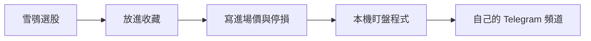

# 進場：收藏股票的到價通知

選股只給候選名單。放進收藏的股票，要先寫交易計畫：**什麼價格進場、錯了在哪裡停損**。價格到了，手機收到通知，再依計畫決定要不要下單。



## 1. 啟動本機版選股器

到價通知要存自己的 Token，只能在自己電腦執行；公開完成版只能看畫面。

```powershell
python -X utf8 stock-picker/serve.py
```

開 `http://127.0.0.1:8766`，選股後在想追蹤的股票按 ☆，再按右上角「我的收藏」。

## 2. 填自己的 Bot 與頻道

在收藏頁的「1　我的 Telegram」填：

| 欄位 | 填什麼 |
|---|---|
| Bot Token | BotFather 給的 `123456789:AA…` |
| 頻道或聊天 ID | `@我的頻道`、`-100` 開頭的頻道 ID，或自己的數字聊天 ID |

按「存到本機」，再按「傳送測試訊息」，手機或頻道收到才算設定完成。

- Token 只寫進自己電腦的 `.local/telegram.env`（不會進 GitHub），網頁存完就不再顯示。
- 送到頻道：先把自己的 Bot 加成**頻道管理員**，否則 Telegram 會拒絕。
- 送給自己：先對 Bot 傳 `/start`。
- 不要把 Token 貼給 AI 或放進截圖。

## 3. 每檔收藏寫進場計畫

| 欄位 | 意思 |
|---|---|
| 進場條件 | **突破 ≥**：價格漲到這裡以上才進場（追突破）；**回到 ≤**：價格回到這裡以下才進場（等拉回） |
| 進場價 | 必填。沒填的股票不監看 |
| 停損價 | 選填。通知會一起提醒你：錯了在哪裡出場 |
| 計畫備註 | 為什麼是這個價：前高、均線、型態頸線… |

按「儲存到價設定」，存到 `.local/price-alerts.json`。

## 4. 開始盯盤

```powershell
python -X utf8 scripts/price_alert.py
```

- 平日 09:00–13:30，每 5 分鐘查一次證交所報價，一次最多 20 檔。
- 每檔碰到進場價只通知**一次**，狀態改成「已觸發」；想再監看，在收藏頁按「重新監看」。
- 全部觸發完自動結束；按 `Ctrl+C` 隨時停止。電腦關機或睡眠就不會通知。

課堂沒開盤，先用模擬價測一次通知（不改狀態）：

```powershell
python -X utf8 scripts/price_alert.py --fake-price 2330=1100
```

只想看現在價格與訊息、不傳送：`--dry-run`。

## 限制要先知道

- 報價用證交所 MIS 網站內部端點，非官方公開 API；最多延遲到下一輪 5 分鐘。要即時、逐筆或自動下單，要用券商 API。
- 到價是「看到成交價碰到」，不是「你買得到這個價」；跳空、漲跌停都可能讓實際成交不同。
- 熱門股常在查價那一刻沒有成交價，這時改看買得到／賣得到的那一邊：突破用最佳買價、回到用最佳賣價，訊息會註明。
- 國定假日沒有特別判斷，只是查不到新成交。
- 這是提醒，不會下單。

## 交給 AI 的指令

```text
請讀 AGENTS.md 與 docs/price-alerts.md。
幫我啟動本機選股器，我會自己在收藏頁填 Bot Token 與頻道，你不要讀取或回顯 .local/telegram.env。
我收藏了幾檔股票，帶我替每一檔寫進場條件、進場價、停損價與理由。
先用 --fake-price 模擬一則通知，我確認手機收到後，再開始盤中盯盤。
不要改選股規則，不要加自動下單。
```
