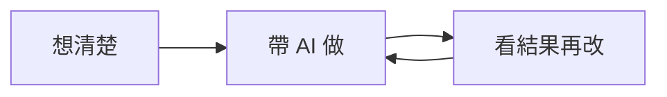
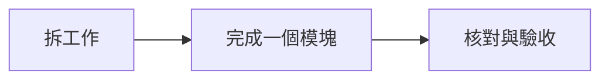
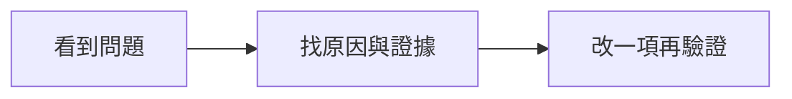

# 最後的禮物：帶 AI 完成自己的交易工具

上一堂學會用 AI，這一堂學會帶 AI 把事情做完。

你可以直接複製下面的指令，把【】換成自己的內容。不必一次填完，也不必一次叫 AI 完成整套軟體；每個階段完成後，再接下一段。

## 整堂課，只記住這張圖



想清楚自己要解決什麼問題，帶 AI 分步完成，看到結果之後找原因、修改、再驗證。結果只是下一步的依據。

## 1. 想清楚：把我的經驗變成設計

先準備自己的課程筆記、策略說明或軟體說明書。畫面可以作參考，但看不到的公式要保留為未知。

**直接複製給 AI：**

```text
我想做一個自己會使用的交易工具，請先和我設計框架。

我的投資方式：【波段／當沖／動能／籌碼／其他】
我想解決的問題：【例如每天選股花太多時間】
我想參考的策略或軟體：【名稱與我提供的說明】
我已有的知識：【課程筆記、書本整理、自己的經驗】
我的核心規則：【目前能說清楚的條件】
我自己的判斷與限制：【進出場、風險、使用情境】

請先整理：
1. 來源已明確說明的規則。
2. 我自己增加的判斷。
3. 尚未說清楚或缺資料的地方。

接著用三個大區塊畫出軟體框架，說明每區的用途與資料需求。
現在先不要寫整套程式；需要我補充時，一次只問最關鍵的問題。
看不見的公式不要猜，缺資料的地方請留下來。
```

**這一步完成的標準：**你能解釋工具的用途；AI 能列出核心規則與缺項。

## 2. 帶 AI 做：拆工作、做一塊、驗收一塊



**直接複製給 AI：**

```text
請按照剛剛確認的框架，把第一版拆成可以分步完成的模塊。

第一版只要完成：【一條資料到訊號到畫面的完整流程】

每個模塊請寫清楚：
- 輸入：需要哪些資料與欄位？
- 處理：套用哪個已確認的規則？
- 輸出：產生什麼檔案或畫面？
- 驗收：我怎麼知道它真的完成？
- 依賴：哪些步驟要先完成？

建立一份工作進度表，使用「未開始、進行中、待我確認、已完成、受阻」。
每一項都要有產物位置、驗收證據與下一步。
先完成目前最前面的可執行模塊，停在我可以核對的地方。
程式能跑、畫面能開，不等於規則已經正確，請另外核對。
```

**這一步完成的標準：**有可檢視的產物，有規則核對，進度寫得出下一步。

## 3. 看結果再改：先找原因，再決定改什麼



**直接複製給 AI：**

```text
我看到的問題是：【例如訊號太多、漏掉候選、交易成本太高】。
請先幫我找原因，不要立刻修改，也不要只挑有獲利的例子。

先檢查：
1. 程式是否照原本規則執行？
2. 資料、時間與欄位單位是否正確？
3. 在前兩項正確後，規則是否不符合我的需求？

每個可能原因都要附證據，找不到證據就標記「待確認」。
請提出一個優先處理的問題，說明為什麼先處理它。
```

找到原因後，再接這段：

```text
這次只修改：【一個模塊／一個條件】。
修改理由：【我想處理哪個問題】。
我的預期：【預期哪些行為會改變，以及可能付出的代價】。

請保留原版，另存新版本，記錄修改的位置與原因。
用相同資料、相同時段、相同成本與資金口徑比較新舊版本。
只有本次指定的一項可以改，其他設定先固定。

請比較：問題有沒有改善、哪些訊號或交易變了、有沒有新問題。
改善、沒差、變差都要保留，不要為了漂亮結果繼續調參。
如果證據不足，請告訴我需要補什麼，而不是說修改一定有效。
```

**這一步完成的標準：**說得出修改原因、預期與證據，能比較新舊版本的行為。

## 一個可以照著做的教學情境

「訊號太多」是你觀察到的問題，還不能直接推論「加成交量一定更好」。先檢查是否重複顯示、原規則是否照做、自己的選股需求是否清楚。如果程式與資料正確，再把成交量當成一個待驗證的假設。

先寫：「我預期成交量濾網會減少候選，但也可能排除我想看的股票。」保留原版，只增加這個條件，再對照哪些候選被排除、是否符合自己的需求。即使沒有改善，也完成了一次有紀錄的驗證。

這是示範修改的思路，不是聲稱這個條件一定比較好。

## 4. 每次完成，都存回自己的知識庫

**直接複製給 AI：**

```text
請把這次過程整理成一則 Markdown 實作筆記。

包含：日期、資料截止時間、來源、原始想法、已確認規則、遇到的問題、
修改理由、預期、實際觀察、成功或失敗、尚未確認、下一步與檔案位置。

把「來源事實」「我的判斷」「AI提出的假設」「驗證過的觀察」分開寫。
結論要限定在這次資料與測試範圍。
在可以存檔的環境，存到我指定的 Obsidian 資料夾；不能存檔就輸出完整 Markdown。
存檔後列出實際檔案位置，不要只說已記住。
```

Obsidian 先沿用上一堂的資料夾；Dify 可之後再串接。此操作單本身不會自動連線 Dify、Telegram 或背景排程。知識有留下來，也要讓下次的 AI 讀取並核對。

## 5. 中斷之後，讓 AI 接著做

**離開之前複製：**

```text
請更新進度，並在專案建立「續工單.md」。
寫清楚：已完成、檔案位置、驗收證據、失敗嘗試、目前阻礙、下一步、
恢復工作要先讀的檔案，以及哪些地方仍待我確認。
沒有產物或驗收證據的項目不要標成已完成。
```

**回來之後複製：**

```text
請先讀這個專案的進度表與「續工單.md」，再核對相關檔案是否存在。
告訴我目前在哪一步、還缺什麼、下一步要做什麼。
從第一個可執行的未完成項目接續，不要重新做已經驗收的內容。
如果工作狀態已改變，先更新紀錄；如果仍受阻，說明阻礙。
```

## 我自己的實作填空

```text
我要做的工具：
我想解決的問題：
知識來源：
核心規則：
第一版先完成：
目前在哪一步：
我看到的問題：
原因與證據：
這次只改哪一項：
修改理由與預期：
新舊版本的觀察：
存檔位置與下一步：
```

這份答案包可以一直用。每次換成自己的需求，逐步補上知識，讓 AI 幫你把想法做成能檢查、能修改、能維護的工具。


## 新增禮物：自己的雪鴞選股實作室

[開啟完成頁](https://duang0615.github.io/ai-alchemy-trading-lab/stock-picker/) · [兩次練習與可複製指令](stock-picker-workbook.md) · [實作Skill](../skills/snowyowl-picker-lab/SKILL.md)

從18張卡片拆出欄位、公式、資料與畫面，再寫自己的進出場計畫。公開小樣本與本機全資料範圍分開。缺資料停止，修改先寫假設，只改一項，保存證據。
