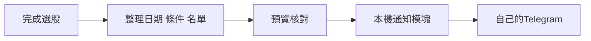

# 延續上一堂：把選股結果送到自己的 Telegram

不重教建立 Bot。沿用上一堂自己的 Bot Token 與私人聊天 ID；先向自己的 Bot 傳 `/start`。私人通知用自己的數字 chat_id；群組的 chat_id 不同，不能直接把個人 ID 當作群組 ID。



Token 是 Bot 的通行證，chat_id 決定送到哪裡；訊息文字決定要送什麼。通知模塊不改選股公式，選股、回測或工作進度都能提供文字給它。此版是手動單次推送，不是 Telegram 遙控代理或自動排程。

## 學生只要設定自己的兩個值

在專案 `.local/telegram.env` 填入（此資料夾不會進 GitHub）：

```dotenv
TELEGRAM_BOT_TOKEN=填入上一堂自己的BotToken
TELEGRAM_CHAT_ID=填入自己的數字聊天ID
```

由學生在本機編輯器填入，AI 不讀取或回顯這個檔案，也不把 Token 放進網頁。範例程式執行時才讀取它。此範例只用 Python 標準函式庫，不需要再裝 Telegram 套件。

## 休息實作：用完成版名單發一則訊息

先用專案附帶的真實教學快照預覽：

```powershell
python -X utf8 scripts/telegram_notify.py --demo --strategy trend
```

此步驟**不讀取 Token、不連 Telegram**。核對 `.local/telegram-preview.txt`：資料日、策略、範圍、候選數、股號與成交量。教學樣本16檔、資料2026-10-02，不是當日即時行情。零候選也會明確通知。

學生決定將此內容送到自己的 Bot 後，執行：

```powershell
python -X utf8 scripts/telegram_notify.py --demo --strategy trend --env .local/telegram.env --send
```

用自己的雪鴞快照時，將 `--demo` 換為 `--snapshot .local/stock-picker-data.json`。網頁調過的最低量也要使用相同 `--min-volume`，不要把網頁自訂規格與預設規則混用。

傳送網頁匯出的實際 CSV（包括型態選股）時：

```powershell
python -X utf8 scripts/telegram_notify.py --csv "自己的選股.csv" --date "資料日" --rule "當次選股條件與範圍"
# 核對後，用相同參數再加 --env .local/telegram.env --send
```

回測摘要、待辦或其他文字：

```powershell
python -X utf8 scripts/telegram_notify.py --text-file "要通知的內容.txt"
# 核對後，用相同參數再加 --env .local/telegram.env --send
```

訊息過長會分段傳送，使用純文字，保留原文字中的符號。程式記錄成功訊息編號與內容雜湊，沒有自動重送。逾時或部分失敗，先核對手機實際收到幾則，再決定下一步。收到 API 成功回覆不等於使用者已讀。

## 交給 AI 的指令

```text
請讀 AGENTS.md 與 skills/telegram-results-lab/SKILL.md。
沿用我上一堂自己的Telegram Bot，不要重教申請Bot。
先以附帶的多頭排列教學樣本整理通知，包含日期、條件、範圍與名單。
先執行預覽；我要確認傳到哪裡、傳什麼。
我會自己在.local/telegram.env填入Token與聊天ID，你不要讀取或回顯。
在我明確說「把這份內容送到自己的Telegram」後才执行 --send。
保留發送結果與下一步；選股規則不要改。
```

## 驗收與設計邏輯

1. 雪鴞與網頁負責選股，通知模塊只負責傳送。
2. 預覽中的規格、資料日與名單和選股結果相同。
3. 程式有成功回覆，手機也實際收到同一份內容，才算這次串接驗收完成。
4. 失敗先查 Token、chat_id、`/start`、網路與回覆，不重跑或改動選股策略。

本教材已驗證訊息生成、UTF-16 長度分段、送出請求格式與模擬回覆；尚未使用學生的真實 Token 實際送件。

官方規格：[sendMessage](https://core.telegram.org/bots/api#sendmessage)。
